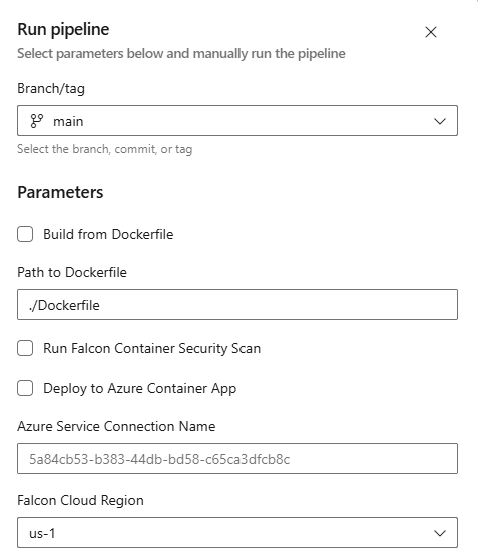
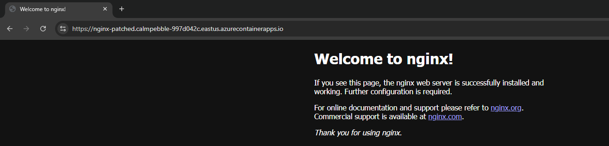
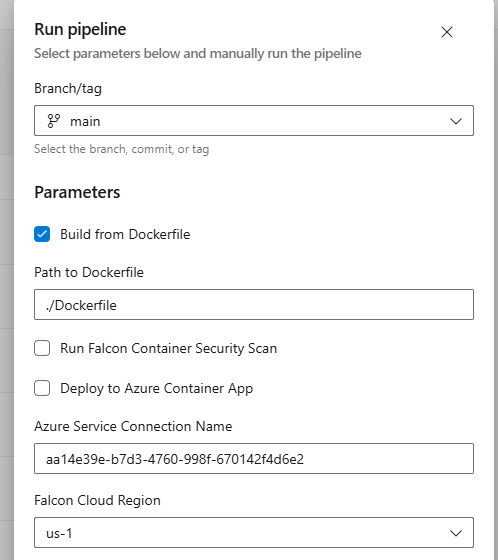
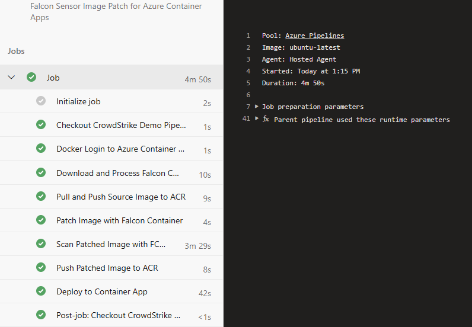

# Falcon Container Security Pipeline for Azure Container Apps

This pipeline enables you to patch container images with Falcon Container Security and optionally deploy them to Azure Container Apps. It supports both building from a local Dockerfile or pulling from Docker Hub.

## Prerequisites

### Azure Resources

1. Azure Container Registry (ACR)
2. Azure Container Apps Environment
3. Resource Group

### Service Connections in Azure DevOps

1. **Azure Resource Manager Connection**
   - Purpose: ACA deployment and ACR access
   - Permissions: Contributor on Resource Group

2. **Docker Registry Connection**
   - Name: 'acr'
   - Type: Azure Container Registry
   - Purpose: Docker build and push operations

### Variable Group

Create a variable group named 'falcon-credentials' containing:
```
FALCON_CLIENT_ID
FALCON_CLIENT_SECRET
FALCON_CID
FALCON_CID_FCS
ACR_USERNAME
ACR_PASSWORD
```

## Required Variables

Below are all the variables you need to define before using this pipeline.

### Azure Container Registry Configuration

| Variable | Description | Example | Required |
|----------|-------------|---------|----------|
| acrName | Name of your Azure Container Registry | 'mycompany-acr' | Yes |
| acrLoginServer | Full ACR server URL (auto-generated) | '$(acrName).azurecr.io' | No - Auto |

### Azure Resource Configuration

| Variable | Description | Example | Required |
|----------|-------------|---------|----------|
| resourceGroup | Azure resource group name | 'rg-myapp-prod' | Yes |
| location | Azure region | 'eastus' | Yes |

### Container App Configuration

| Variable | Description | Example | Required |
| containerAppName | Name of your Container App | 'myapp-web' | Yes |
| containerAppEnv | Name of your Container Apps Environment | 'prod-environment' | Yes |
| containerAppPort | Primary container port | '80' | Yes |

## Repository Structure

``` markdown
your-repo/
├── .azure-pipelines/
│   └── falcon-aca-deploy.yml
├── docker/
│   ├── Dockerfile
│   └── index.html
└── README.md
```

### Sample Dockerfile

```dockerfile
FROM nginx:alpine
COPY index.html /usr/share/nginx/html/
```

### Sample index.html

```html
<!DOCTYPE html>
<html>
<body>
    <h1>Hello from Container!</h1>
    <p>Running and healthy</p>
</body>
</html>
```

## Pipeline Features

- Build from Dockerfile or pull from Docker Hub
- Patch images with Falcon Container Security
- Optional FCS scanning
- Optional deployment to Azure Container Apps
- Support for all Falcon Cloud regions
- Hourly automated runs (configurable)

## Usage Examples

### Basic Run (Pull from Docker Hub)

```bash
az pipelines run --name falcon-aca-deploy
```

### Build from Dockerfile

```bash
az pipelines run --name falcon-aca-deploy --parameters useDockerfile=true
```

### Full Security Pipeline with Deployment

```bash
az pipelines run --name falcon-aca-deploy \
  --parameters useDockerfile=true \
  --parameters runFCSScan=true \
  --parameters deployToACA=true
```

## Pipeline Parameters

| Parameter | Description | Default | Options |
|-----------|-------------|---------|---------|

| useDockerfile | Build from local Dockerfile | false | true/false |
| dockerfilePath | Path to Dockerfile | './Dockerfile' | Any valid path |
| runFCSScan | Run FCS scan | false | true/false |
| deployToACA | Deploy to ACA | false | true/false |
| falconRegion | Falcon Cloud Region | 'us-1' | us-1, us-2, eu-1, us-gov-1, us-gov-2 |

## Visual Examples

### Pipeline Configuration



Azure DevOps pipeline run dialog showing configurable parameters including Dockerfile option, FCS scan, and deployment choices*

### Example Pipeline Runs


*Default nginx deployment in Azure Container Apps showing successful deployment and accessibility*

#### 2. Custom Dockerfile Build


*Custom nginx deployment showing the personalized index.html content running in ACA*

#### 3. Full Patch Ppeline


*Complete pipeline run with all security features enabled:*

- Custom image build
- Falcon sensor integration
- FCS scan results
- Security validations
- Successful ACA deployment

## Error Handling

The pipeline includes comprehensive error yes andling for:

- ACR authentication
- Image builds and pulls
- Falcon sensor operations
- Image patching
- FCS scanning
- ACA deployment

## Security Notes

- All secrets stored in variable group
- Service principals use minimum required permissions
- Image digests tracked for verification
- Optional FCS scanning for security compliance
